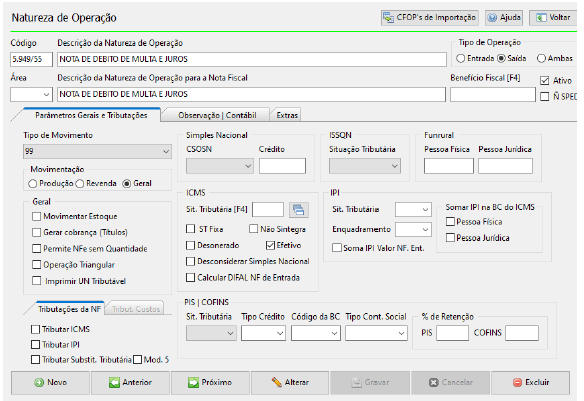
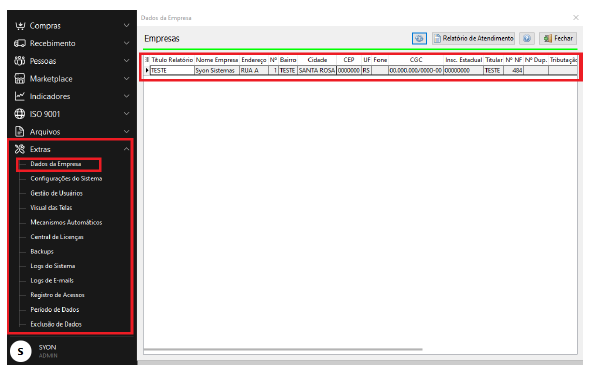
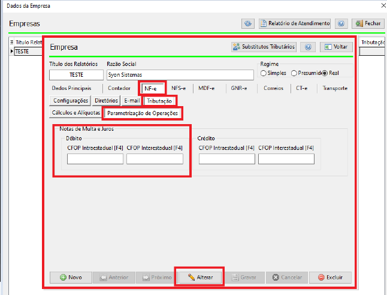
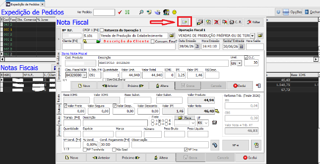

import { Steps, Aside } from '@astrojs/starlight/components';

Este manual apresenta o passo a passo para emissão da Nota Fiscal de Débito referente a Multa e Juros Recebidos.

## Quando emitir

Emita uma NF-e de Multa e Juros quando precisar cobrar do cliente valores de multa ou juros (por atraso de pagamento, por exemplo) em um documento fiscal próprio, separado da nota de venda original.

## Pré-requisitos

Antes de iniciar, garanta que:

- [ ] Você tem acesso ao módulo de **Expedição**
- [ ] Você tem permissão para cadastro de CFOPs e parametrização de operações
- [ ] A nota fiscal de origem (venda) já existe no sistema

<Aside type="caution" title="Importante">
Todo o processo precisa ser feito com atenção às parametrizações: a nota deve sair **sem movimentar estoque**, **sem gerar cobrança** e **sem nenhuma tributação**.
</Aside>

## Passo 1 — Cadastrar os CFOPs 5.949 e 6.949

Acesse o cadastro de **Natureza de Operação** e cadastre os dois CFOPs da tabela abaixo.

| Campo | Valor |
|-------|-------|
| **Código** | 5.949 ou 6.949 |
| **Descrição da Natureza de Operação** | NOTA DE DEBITO DE MULTA E JUROS |
| **Tipo de Operação** | Saída |
| **Tipo de Movimento** | 99 - Geral |
| **Movimentação** | Geral |

<Aside type="tip" title="Dica">
Se o CFOP já existir, você pode criar uma variação adicionando `/` seguido de um número ao final. Exemplo: `5.949/12`
</Aside>

### Aba "Geral"

Nenhum checkbox deve estar marcado:

- [ ] Movimentar Estoque
- [ ] Gerar cobrança (Títulos)
- [ ] Permitir NFe sem Quantidade
- [ ] Operação Triangular
- [ ] Imprimir DN Ref Tributável

### Tributações

Configure todas sem tributação:

| Tributação | Configuração |
|------------|--------------|
| **ICMS** | Sem tributação |
| **IPI** | Sem tributação |
| **PIS/COFINS** | Sem tributação |

<Aside type="danger" title="Atenção">
Confira os três pontos antes de continuar: **sem movimentar estoque**, **sem gerar cobrança** e **sem tributação**. Qualquer divergência aqui gera erro na NF-e.
</Aside>



## Passo 2 — Conferir os Dados da Empresa

Abra o cadastro da empresa que será a emitente da NF-e:

<Steps>

1. **Acesse o cadastro**

   Vá em **Extras → Dados da Empresa**.

2. **Selecione a empresa**

   Abra o cadastro da empresa que será utilizada na emissão.

</Steps>

```
Extras → Dados da Empresa → [Selecionar Empresa]
```



## Passo 3 — Parametrizar as Operações

Informe ao sistema quais CFOPs usar nas notas de multa e juros:

<Steps>

1. **Abra a parametrização**

   Acesse **NF-e → Tributação → Parametrização de Operações**.

2. **Localize a seção**

   Encontre a seção **Notas de Multa e Juros**.

3. **Informe os CFOPs na coluna Débito**

   | Campo | CFOP |
   |-------|------|
   | **CFOP Intraestadual** | 5.949 |
   | **CFOP Interestadual** | 6.949 |

4. **Salve**

   Clique em **Alterar** para salvar as configurações.

</Steps>

```
NF-e → Tributação → Parametrização de Operações
```



## Passo 4 — Gerar a NF-e de Multa e Juros

### 4.1 Acessar a nota fiscal de origem

<Steps>

1. **Abra a nota**

   Acesse **Expedição → Expedição de Pedidos** e abra a nota sobre a qual deseja gerar a NF-e de multa ou juros.

2. **Localize o ícone**

   Na barra de ferramentas da tela **Nota Fiscal**, localize o ícone indicado (seta verde ao lado do botão "Excluir").

</Steps>

### 4.2 Selecionar o tipo

<Steps>

1. **Clique no ícone de NF-e Multa e Juros**

   Será exibido um menu com a opção **"NF-e Multa e Juros"**. Clique nela para continuar.

</Steps>



### 4.3 Definir o valor

<Steps>

1. **Informe o valor**

   No campo **Multa e/ou Juros R$**, informe o valor desejado.

2. **Confirme**

   Clique em **Ok** para confirmar.

</Steps>

### 4.4 Finalizar a NF-e

<Steps>

1. **Aguarde a geração**

   O sistema gera automaticamente a NF-e de multa e juros.

2. **Libere o XML**

   Acesse a NF-e gerada e faça a liberação do XML.

3. **Aprove a NF-e**

   Após a liberação, aprove a NF-e para finalizar o processo.

</Steps>

<Aside type="tip" title="Validação final">
Antes de concluir, confira o checklist: nota sem estoque, sem cobrança, sem tributação, XML liberado e NF-e aprovada.
</Aside>

## Resumo do Fluxo

```
┌──────────────┐    ┌──────────────┐    ┌──────────────┐    ┌──────────────┐
│  Cadastrar   │───▶│   Conferir   │───▶│ Parametrizar │───▶│    Gerar     │
│  CFOPs       │    │   Empresa    │    │  Operações   │    │   NF-e       │
│  5.949/6.949 │    │              │    │              │    │              │
└──────────────┘    └──────────────┘    └──────────────┘    └──────────────┘
```

## Erros comuns

| Problema | Causa provável | Como corrigir |
|----------|----------------|---------------|
| Estoque foi movimentado | Checkbox marcado na aba "Geral" | Volte ao Passo 1 e desmarque **Movimentar Estoque** |
| Imposto calculado na nota | Tributação configurada | Volte ao Passo 1 e deixe ICMS, IPI e PIS/COFINS **sem tributação** |
| CFOP rejeitado ou duplicado | CFOP já cadastrado | Use uma variação com `/` + número (ex.: `5.949/12`) |
| CFOP errado na nota | Parametrização trocada | Confira no Passo 3: 5.949 intraestadual, 6.949 interestadual |

## Dicas

:::tip[Dica]
Utilize o caractere `/` para criar variações do CFOP caso já exista o cadastro padrão.
:::

:::caution[Importante]
Sempre verifique se a nota foi configurada **sem tributação** e **sem movimentação de estoque** antes de gerar a NF-e.
:::

## Próximo Passo

- [Expedição](/modulos/expedicao) - Ver todos os recursos do módulo
